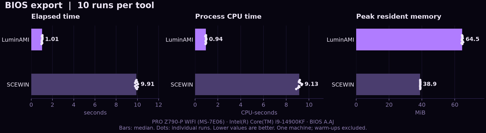
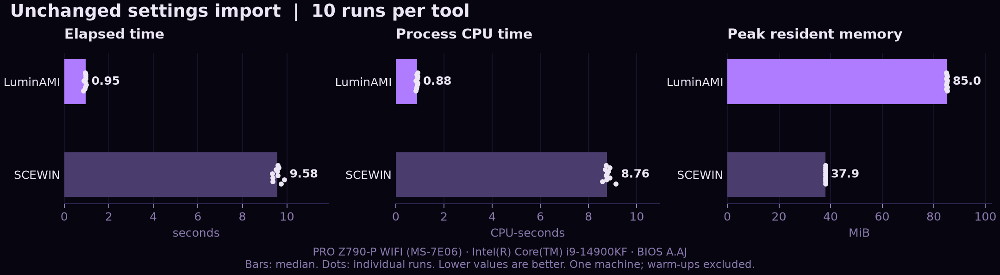

# LuminAMI vs SCEWIN

The measurements and charts below come from a real run on October 4, 2026.
They describe this machine and these tool versions, not every AMI BIOS.
MSI PRO Z790-P WIFI (MS-7E06), BIOS A.AJ, Intel i9-14900KF, 32 logical processors,
32 GiB installed RAM, Windows 11 build 26200. LuminAMI 0.2.1 from source commit
`32d8908`; reference tool AMISCE/SCEWIN 5.05.01.0002. Executable and driver hashes
are recorded in the JSON.

## Export results

| Median of 10 runs | LuminAMI | SCEWIN |
| --- | ---: | ---: |
| Elapsed time | 1.014 s | 9.906 s |
| Process CPU time | 0.938 s | 9.133 s |
| Kernel CPU time | 0.523 s | 7.367 s |
| Peak resident working set | 64.5 MiB | 38.9 MiB |
| Peak committed memory | 61.9 MiB | 155.5 MiB |
| Read I/O | 5.26 MiB | 0.65 MiB |
| Write I/O | 11.68 MiB | 1.68 MiB |
| Other/device I/O | 0.043 MiB | 0.537 MiB |
| Largest sampler gap per run | 58 ms | 403 ms |
| Whole-system busy CPU, including background work | 35.6% | 63.9% |

The median export was 9.77x faster, with 89.8% less elapsed time and 89.7% less
process CPU time. LuminAMI used more resident RAM and file I/O: its full raw
capture/catalog is included in the workload. The idle scheduling controls had
maximum gaps of 11.5 ms before and after the test. Import sampler gaps sometimes
reached 1.19 seconds on SCEWIN; that is not an input-latency measurement.





Raw timing/resource samples and hardware details: [results.json](benchmarks/results.json).
Starting and final varstores were compared byte for byte. Raw BIOS captures,
settings files, private hardware identifiers, and the SCEWIN executable stay local.

LuminAMI exported 6,123 records and SCEWIN 5,406; their HII CRCs matched. A direct
name/offset/width/value comparison found 5,370 matching SCEWIN values (352 with
ambiguous candidate identities), 20 unmapped entries, and 16 entries without an
available current value. Decimal representations were normalized before comparison.
Both text parsers reported 15 option-selection issues. This is not a claim that
the text files or every setting identity are equivalent. Live unchanged imports
succeeded, and final verification matched all 34 captured varstores byte for byte.
All 20 measured export settings bodies also matched their tool's starting export;
SCEWIN's filename/timestamp headers and line endings were normalized for that check.

## Why the measured difference

LuminAMI reads the HII database in bounded chunks and reads each distinct
GUID/name varstore, with bounded retries when a larger buffer is needed. It
deduplicates those reads, then resolves and formats questions from the captured
data. See [capture and transport code](https://github.com/V-Jayy/LuminAMI/blob/32d8908ff552c205273d2870fe1b2fd1f2067e29/src/ami.cpp) and
[export rendering](https://github.com/V-Jayy/LuminAMI/blob/32d8908ff552c205273d2870fe1b2fd1f2067e29/src/engine.cpp).

The largest measured CPU difference was kernel time: 0.523 vs 7.367 seconds.
That is consistent with less repeated driver/firmware work in LuminAMI's
pipeline, but kernel time also includes other OS work. SCEWIN is a closed-source
binary here; no API-call or SMI-count trace was collected, so the exact internal
cause is an inference, not a proven exclusive explanation. Windows counters
cannot isolate all firmware execution, and a scheduling gap alone cannot identify
its cause. These results support the observed speed and responsiveness difference
on this machine, rather than a universal claim about every SCEWIN release.

The unchanged-import median was 0.951 vs 9.576 seconds. LuminAMI's unchanged
plan contained zero patches and skips variable writes. That shortcut is part of
the measured behavior; changed-profile imports may behave differently.

## Method

- Windows x64, administrator terminal, same current BIOS settings and supported
  AMI driver bytes. No reboot, affinity, priority, or Windows security changes.
- Ten measured runs per tool per operation, one warm-up per tool per operation,
  alternating LuminAMI/SCEWIN and SCEWIN/LuminAMI order. One second between runs.
- Each export starts a new process and uses fresh output paths. SCEWIN runs
  `/O /S settings.txt /SD Dupes.txt`. LuminAMI exports text, duplicates, and its
  raw capture/catalog needed for validated imports. Output formats/sizes differ.
- Imports use each tool's own unmodified full current-settings export. SCEWIN
  runs `/I /S current.txt`; LuminAMI runs a live import with a fresh journal.
  LuminAMI skips unchanged variable writes. This is **unchanged settings import**,
  not a benchmark of applying a changed BIOS profile or reboot persistence.
- Final recovery imports the starting SCEWIN profile, then runs LuminAMI restore
  against a fresh capture. A final live capture verifies the starting varstores
  and HII identity. Recovery/verification runs are excluded from charts.

Bars show medians; dots show every measured run. Warm-ups, initial snapshots,
recovery, and final verification are excluded. No outliers are discarded.

## What the counters mean

Elapsed time uses `Stopwatch` around process start through exit, including tool
startup, driver loading, export/import, and cleanup. Driver file extraction is
performed once before timing. CPU time is the process's
accumulated user + kernel time, not elapsed time or total machine CPU percentage.
Memory is the last observed OS-reported peak resident working set, sampled every
10 ms; a peak in the final sampling interval may be missed. Peak commit is
included separately in the JSON and is not physical RAM or actual paging.

Read/write/other I/O are process counters, including buffered disk and device
operations; they are not physical disk traffic. Whole-system CPU includes the
benchmark observer and unrelated background activity. No child-process accounting
or ETW trace is included.

The observer samples from another process roughly every 10 ms. Its largest gap
shows a scheduling pause during the operation. It is **not mouse/input latency**,
an isolated SMI measurement, or proof of the pause's cause. Three-second idle
controls before and after the test are included in the JSON. Background software
can affect both those gaps and system CPU; repeated same-machine results reduce,
but do not eliminate, that uncertainty.

Counter definitions: Microsoft [process CPU times](https://learn.microsoft.com/en-us/windows/win32/api/processthreadsapi/nf-processthreadsapi-getprocesstimes),
[memory counters](https://learn.microsoft.com/en-us/windows/win32/api/psapi/ns-psapi-process_memory_counters),
[I/O counters](https://learn.microsoft.com/en-us/windows/win32/api/winnt/ns-winnt-io_counters),
and [system CPU times](https://learn.microsoft.com/en-us/windows/win32/api/processthreadsapi/nf-processthreadsapi-getsystemtimes).

## Run it yourself

Close other AMI utilities, then use an administrator PowerShell terminal.
Supply your own SCEWIN executable; it is not included in LuminAMI.

```powershell
.\scripts\benchmark.ps1 -Scewin "C:\AMI\SCEWIN_64.exe" -Runs 10 -Output .\benchmark-results

# Also benchmark live imports of the unchanged starting profile.
.\scripts\benchmark.ps1 -Scewin "C:\AMI\SCEWIN_64.exe" -Runs 10 -Output .\benchmark-with-import -IncludeImport
```

The import option invokes real firmware import paths. Keep the entire local
results folder and its recovery files. A failure is recorded in `completion.json`;
do not publish a performance claim when completion or final verification fails.

To render an already completed run (Python with matplotlib):

```powershell
python -m pip install matplotlib
python .\scripts\render-benchmark.py .\benchmark-with-import --output .\docs\benchmarks
```

The renderer reads saved results only and never accesses firmware.
